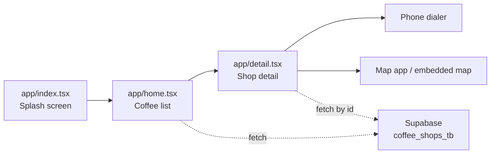

# TOP BKK COFFEE APP

```txt
+------------------------------------------------------+
| BANGKOK COFFEE FIELD GUIDE                           |
| Mobile app for finding, calling, and mapping cafes    |
| Stack: Expo + React Native + TypeScript + Supabase    |
+------------------------------------------------------+
```

แอปนี้ทำหน้าที่เป็นลายแทงร้านกาแฟในกรุงเทพฯ สำหรับมือถือ เปิดมาแล้วเห็นรายชื่อร้าน กดเข้าไปดูรายละเอียด โทรหาร้าน หรือเปิดตำแหน่งบนแผนที่ได้ทันที

GitHub: `https://github.com/Korn3444/rn-top-bkk-coffee-app`

## App Flow



## What It Does

เปิดแอปแล้วผู้ใช้จะเจอ splash screen ก่อนเข้าสู่หน้ารายการร้านกาแฟ รายการทั้งหมดถูกดึงจาก Supabase table `coffee_shops_tb` และเรียงตามชื่อร้าน

เมื่อเลือกหนึ่งร้าน แอปจะแสดงรูปภาพ รายละเอียด ย่าน เบอร์โทร และแผนที่ปักหมุดตำแหน่งร้าน ปุ่มโทรจะเปิด dialer ของเครื่อง ส่วนแผนที่จะพาไปยัง Google Maps หรือ Apple Maps ตาม platform

## Stack Snapshot

```txt
Mobile     : Expo 54, React Native 0.81
Language   : TypeScript 5.9
Navigation : Expo Router
Backend    : Supabase Postgres + Storage
Map        : react-native-maps
Image      : expo-image
Font       : Kanit
```

## Run Locally

```bash
npm install
npx expo start
```

หลังจาก Metro เปิดแล้ว:

- กด `a` เพื่อเปิด Android emulator
- กด `w` เพื่อเปิดบน web
- สแกน QR ด้วย Expo Go เพื่อทดสอบบนมือถือจริง

ถ้าเพิ่งแก้ค่า Supabase หรือข้อมูลไม่ refresh ให้ล้าง cache:

```bash
npx expo start -c
```

## Supabase Contract

แอปอ่านข้อมูลจาก table เดียว:

```txt
public.coffee_shops_tb
```

โครงสร้างข้อมูลที่แอปคาดหวัง:

```sql
create table public.coffee_shops_tb (
  id uuid primary key default gen_random_uuid(),
  name text not null,
  district text not null,
  description text not null,
  image_url text not null,
  phone text,
  latitude float8 not null,
  longitude float8 not null
);
```

เปิดให้อ่านข้อมูลจากแอปได้ด้วย RLS policy นี้:

```sql
alter table public.coffee_shops_tb enable row level security;

create policy "Public can read coffee shops"
on public.coffee_shops_tb
for select
to anon
using (true);
```

## Image URL Rule

รูปในแอปต้องเป็น URL ที่เปิดจาก browser ได้ ไม่ใช่ path ในเครื่อง เช่น `C:\Users\...`

แนวทางที่แนะนำ:

1. ไปที่ Supabase Storage
2. สร้าง bucket ชื่อ `coffee_shops_bk`
3. ตั้ง bucket เป็น public
4. อัปโหลดรูป
5. Copy public URL
6. วาง URL นั้นใน column `image_url`

ตัวอย่างรูปแบบ URL:

```txt
https://YOUR_PROJECT.supabase.co/storage/v1/object/public/coffee_shops_bk/shop-01.jpg
```

## Sample Data

ใช้ SQL นี้เป็นตัวอย่างสำหรับเพิ่มร้านแรก:

```sql
insert into public.coffee_shops_tb
  (name, district, description, image_url, phone, latitude, longitude)
values
  (
    'Roast Runner',
    'Ari',
    'ร้านกาแฟบรรยากาศดี เหมาะกับนั่งทำงานและแวะพักช่วงบ่าย',
    'https://YOUR_PROJECT.supabase.co/storage/v1/object/public/coffee_shops_bk/roast-runner.jpg',
    '0812345678',
    13.7806,
    100.5448
  );
```

## File Map

```txt
app/index.tsx        splash screen แล้วส่งไป /home
app/home.tsx         ดึงรายการร้านจาก Supabase และแสดง FlatList
app/detail.tsx       ดึงร้านตาม id, แสดงรูป, โทร, แผนที่
services/supabase.ts ตั้งค่า Supabase client
types.ts             type CoffeeShop ที่ใช้ร่วมกัน
assets/images/       รูปและไอคอนของแอป
```

## Quick Debug

ถ้าขึ้นว่า `ยังไม่มีร้านในระบบ` แปลว่าแอปต่อ Supabase ได้แล้ว แต่ query ได้ข้อมูลกลับมา `0` แถว ให้เช็กสามเรื่องนี้:

- table ต้องชื่อ `coffee_shops_tb`
- ใน table ต้องมี row อย่างน้อยหนึ่งรายการ
- RLS ต้องมี policy ให้ `anon` อ่านข้อมูลได้

ถ้ารูปไม่ขึ้น ให้ลองเปิดค่า `image_url` ใน browser ก่อน ถ้า browser เปิดไม่ได้ แอปก็โหลดไม่ได้เหมือนกัน

ถ้ากดเข้ารายละเอียดแล้วไม่เจอร้าน ให้ตรวจว่า column `id` เป็น uuid จริง และค่าที่ส่งมาจากหน้า list ตรงกับ row ใน Supabase

## Project Identity

```txt
Package : rn-top-bkk-coffee-app
Version : 1.0.0
Owner   : Korn3444
Purpose : Mobile coffee shop guide powered by Supabase
```
